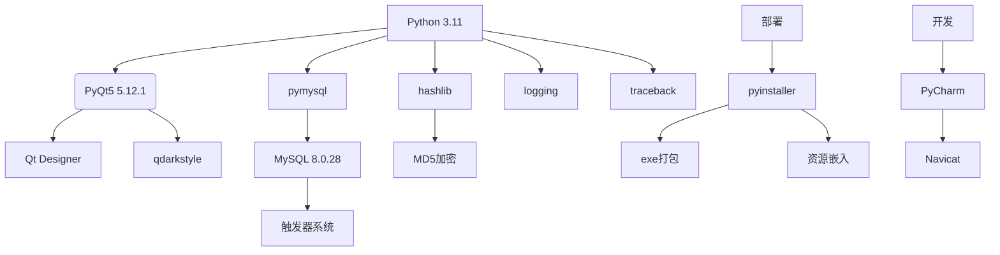

# 设计文档

[toc]

## 需求分析

### 开发系统需求

- 操作系统：Windows

- 数据库：Mysql 8.0

- 前端框架：PyQt5
- 后端语言：python 3.11
- 数据库交互：pymysql
- ide工具：PyCharm



### 背景需求

随着图书数量的不断增长和借阅管理的复杂化，传统的纸质或Excel方式已无法满足图书馆或单位对图书采购、库存、租借等环节的高效管理需求。因此，开发一个结构清晰、功能全面的图书管理系统具有重要的实际意义。本项目作为《数据库原理与设计》课程的综合实践任务，旨在通过前端界面设计与后端数据库建模相结合的方式，实现一个面向用户和管理员的完整图书管理解决方案。

### 软件功能设计

本系统目标是实现一个图形化界面的图书管理平台，借助 PyQt5 进行客户端开发，结合 MySQL 数据库存储和操作，实现对图书信息的全流程管理，包括采购、库存、淘汰、租借、用户权限等。软件实现了三个大模块功能。

**身份验证模块**：图书馆管理系统包含两种身份角色，管理员和普通学生。两种身份均支持账号注册、密码修改、图书检索等基础功能。管理员账号具有最高权限，可通过菜单栏直接访问所有管理功能；普通学生仅能操作个人借阅记录，在借阅书籍时受到5本上限限制。系统通过`IsAdmin`字段区分权限等级，管理员可执行用户管理操作，学生则无此权限。

**管理员功能模块**：管理员具备以下核心权限：

- 添加书籍：录入新书信息（书名/书号/作者/分类），自动触发`after_buy_or_drop_book`触发器同步更新`NumStorage`和`NumCanBorrow`字段

- 淘汰书籍：选择书号和数量执行淘汰操作，触发器同步减少库存

- 图书库存维护：通过`buyordrop`表记录采购/淘汰历史，支持按时间维度分析图书流通数据

- 删除用户账户及其关联借阅记录

  

**学生功能模块**：普通学生拥有以下功能：

- 图书借阅：实时查询库存状态，借阅时自动校验库存余量
- 图书归还：归还时触发库存恢复机制
- 借阅管理：查看完整借阅历史（含已归还记录）
- 自助服务：修改个人密码

## 数据库设计

### 整体框架


### E-R图


### 关系模式规范

​	由ER图中抽象出关系模型，经合并冗余信息，结合功能需求优化得下述关系模式：

* **用户信息**（`StudentId`，姓名，密码，是否管理员，累计借书次数，当前借阅数量）

  **主键：** `StudentId`

  **函数依赖分析：**

  - 存在依赖：`StudentId` → `Name`，`Password`，`IsAdmin`，`TimesBorrowed`，`NumBorrowed`
  - 没有部分依赖和传递依赖，左部是主属性

  **范式判断：**

  - 因为所有非主属性完全依赖于候选码 `StudentId` 且没有冗余依赖，
  - 所以该关系模式符合 **BCNF**。

* **图书信息**（`BookId`，书名，作者，分类，出版社，出版时间，库存量，可借阅数量，累计借阅次数）

  **主键：** `BookId`

  **函数依赖分析：**

  - 存在依赖：`BookId` → 其余所有属性
  - 所有非主属性都依赖于主键 `BookId`

  **范式判断：**

  - 没有部分或传递依赖，左部为候选码，
  - 因此该关系模式符合 **BCNF**。

* **借阅记录**（`StudentId`，`BookId`，借出时间，归还时间，借阅状态）

  **主键：** `BookId`

  **函数依赖分析：**

  - 存在依赖：`BookId` → 其余所有属性
  - 所有非主属性都依赖于主键 `BookId`

  **范式判断：**

  - 没有部分或传递依赖，左部为候选码，
  - 因此该关系模式符合 **BCNF**。

* **采购/淘汰记录**（`BookId`，操作日期，操作类型，数量）

  **主键：** 可选 (`BookId`, `Time`)（在实际中，操作时间和书号联合唯一标识一次采购或淘汰）

  **函数依赖分析：**

  - (`BookId`, `Time`) → `BuyOrDrop`, `Number`
  - 不存在部分依赖或传递依赖

  **范式判断：**

  - 联合主键完整决定非主属性，左部是候选码，
  - 因此该关系模式也符合 **BCNF**。

### 数据表简要设计

使用了`utf8mb4_0900_ai_ci` 这一种字符集排序规则

1. 用户表（User）

   ```SQL
   CREATE TABLE user  (
     StudentId varchar(20) CHARACTER SET utf8mb4 COLLATE utf8mb4_0900_ai_ci NOT NULL,
     Name varchar(20) CHARACTER SET utf8mb4 COLLATE utf8mb4_0900_ai_ci NULL DEFAULT NULL,
     Password varchar(32) CHARACTER SET utf8mb4 COLLATE utf8mb4_0900_ai_ci NOT NULL,
     IsAdmin int NULL DEFAULT 0,
     TimesBorrowed int NULL DEFAULT 0,
     NumBorrowed int NULL DEFAULT 0,
     UNIQUE INDEX StudentId(StudentId ASC) USING BTREE
   ) ENGINE = InnoDB CHARACTER SET = utf8mb4 COLLATE = utf8mb4_0900_ai_ci ROW_FORMAT = DYNAMIC;CREATE TABLE `User` (
     `StudentId` VARCHAR(20) NOT NULL,
     `Name` VARCHAR(20),
     `Password` VARCHAR(32) NOT NULL,
     `IsAdmin` INT DEFAULT 0,
     `TimesBorrowed` INT DEFAULT 0,
     `NumBorrowed` INT DEFAULT 0,
     PRIMARY KEY (`StudentId`)
   ) ENGINE=InnoDB DEFAULT CHARSET=utf8mb4;
   ```

   | 列名            | 类型          | 说明                               |
   | --------------- | ------------- | ---------------------------------- |
   | `StudentId`     | `varchar(20)` | 学号/用户ID，唯一标识用户。非空。  |
   | `Name`          | `varchar(20)` | 用户姓名。                         |
   | `Password`      | `varchar(32)` | 登录密码（加密存储建议）。         |
   | `IsAdmin`       | `int`         | 是否管理员：0 普通用户，1 管理员。 |
   | `TimesBorrowed` | `int`         | 历史借阅次数（累计）。             |
   | `NumBorrowed`   | `int`         | 当前借阅中的图书数量。             |

2. 图书表（Book）

   ```SQL
   CREATE TABLE book  (
     BookName varchar(30) CHARACTER SET utf8mb4 COLLATE utf8mb4_0900_ai_ci NOT NULL,
     BookId char(6) CHARACTER SET utf8mb4 COLLATE utf8mb4_0900_ai_ci NOT NULL,
     Auth varchar(20) CHARACTER SET utf8mb4 COLLATE utf8mb4_0900_ai_ci NOT NULL,
     Category varchar(10) CHARACTER SET utf8mb4 COLLATE utf8mb4_0900_ai_ci NULL DEFAULT NULL,
     Publisher varchar(30) CHARACTER SET utf8mb4 COLLATE utf8mb4_0900_ai_ci NULL DEFAULT NULL,
     PublishTime date NULL DEFAULT NULL,
     NumStorage int NULL DEFAULT 0,
     NumCanBorrow int NULL DEFAULT 0,
     NumBorrowed int NULL DEFAULT 0
   ) ENGINE = InnoDB CHARACTER SET = utf8mb4 COLLATE = utf8mb4_0900_ai_ci ROW_FORMAT = DYNAMIC;
   ```

   | 列名           | 类型          | 说明                                           |
   | -------------- | ------------- | ---------------------------------------------- |
   | `BookName`     | `varchar(30)` | 图书名称，非空。                               |
   | `BookId`       | `char(6)`     | 图书编号，唯一标识一本书，非空。建议设为主键。 |
   | `Auth`         | `varchar(20)` | 作者名，非空。                                 |
   | `Category`     | `varchar(10)` | 图书分类，例如“文学”“科技”等。                 |
   | `Publisher`    | `varchar(30)` | 出版社。                                       |
   | `PublishTime`  | `date`        | 出版时间。                                     |
   | `NumStorage`   | `int`         | 图书总藏量（入库数量）。                       |
   | `NumCanBorrow` | `int`         | 当前可借数量。                                 |
   | `NumBorrowed`  | `int`         | 当前已借出数量。                               |

3. 借阅记录表（User_Book）

   ```SQL
   DROP TABLE IF EXISTS user_book;
   CREATE TABLE user_book  (
     StudentId char(10) CHARACTER SET utf8mb4 COLLATE utf8mb4_0900_ai_ci NOT NULL,
     BookId char(6) CHARACTER SET utf8mb4 COLLATE utf8mb4_0900_ai_ci NOT NULL,
     BorrowTime date NULL DEFAULT NULL,
     ReturnTime date NULL DEFAULT NULL,
     BorrowState bit(1) NULL DEFAULT b'0'
   ) ENGINE = InnoDB CHARACTER SET = utf8mb4 COLLATE = utf8mb4_0900_ai_ci ROW_FORMAT = DYNAMIC;
   ```

   | 列名          | 类型       | 说明                                   |
   | ------------- | ---------- | -------------------------------------- |
   | `StudentId`   | `char(10)` | 借书的用户ID，关联 `user.StudentId`。  |
   | `BookId`      | `char(6)`  | 借的图书ID，关联 `book.BookId`。       |
   | `BorrowTime`  | `date`     | 借书日期。                             |
   | `ReturnTime`  | `date`     | 还书日期（若已归还）。                 |
   | `BorrowState` | `bit(1)`   | 借阅状态：0 表示未归还，1 表示已归还。 |

4. 采购/淘汰记录表（BuyOrDrop）

   ```SQL
   CREATE TABLE buyordrop  (
     BookId char(6) CHARACTER SET utf8mb4 COLLATE utf8mb4_0900_ai_ci NOT NULL,
     Time date NULL DEFAULT NULL,
     BuyOrDrop bit(1) NULL DEFAULT b'0',
     Number int NULL DEFAULT 0
   ) ENGINE = InnoDB CHARACTER SET = utf8mb4 COLLATE = utf8mb4_0900_ai_ci ROW_FORMAT = DYNAMIC;
   ```

   | 列名        | 类型      | 说明                                     |
   | ----------- | --------- | ---------------------------------------- |
   | `BookId`    | `char(6)` | 操作的图书编号，外键关联 `book.BookId`。 |
   | `Time`      | `date`    | 操作发生的时间。                         |
   | `BuyOrDrop` | `bit(1)`  | 标志：0 表示淘汰，1 表示采购。           |
   | `Number`    | `int`     | 操作的数量。                             |


## 界面设计与交互逻辑

### 主界面 (MainWindow.py)

- **核心功能**：

  - 提供统一入口，通过菜单栏控制功能切换
  - 动态显示不同用户身份对应的操作界面

- **组件构成**：

  - 菜单栏包含五个操作项：

    ```mermaid
    graph LR
        注册-->登录
        修改密码-->登录
        退出登录-->登录
        退出-->程序关闭
    ```

  - 中央区域支持动态切换：

    - 初始显示登录界面
    - 登录成功后切换为管理员/学生专属界面
    - 菜单操作可触发界面状态变更

- **信号交互**：

  - 管理员登录信号：触发管理员界面显示
  - 学生登录信号：携带学号参数切换学生界面
  - 菜单操作信号：统一处理界面切换逻辑

### 登录界面 (SignIn.py)

- **核心验证流程**：
  1. 检查账号密码输入完整性
  2. 数据库查询用户信息
  3. 密码MD5加密比对
  4. 根据IsAdmin字段区分权限
- **界面特征**：
  - 输入框：学号、密码
  - 按钮：登录操作
  - 回车快捷键支持
- **异常处理**：
  - 空输入提示
  - 无效账号提示
  - 密码错误提示

### 管理员界面 (AdminHome.py)

- **功能组件**：
  - 三向垂直按钮布局：
    - 添加书籍按钮
    - 淘汰书籍按钮
    - 用户管理按钮
  - 右侧显示图书库存视图
- **权限特征**：
  - 可执行所有数据操作
  - 独占用户管理权限
  - 访问完整图书数据
- **交互逻辑**：
  - 按钮点击事件绑定对应对话框
  - 支持全局数据操作

### 学生界面 (StudentHome.py)

- **功能限制**：
  - 四个核心操作按钮：
    - 借书
    - 还书
    - 借阅状态
    - 所有图书
  - 仅能查看个人借阅记录
  - 无法访问用户管理功能
- **界面特征**：
  - 左侧垂直功能区
  - 右侧动态内容区
  - 权限受限的操作提示

---

## 权限控制体系

### 数据库权限设计

- **user表结构**：

  - `IsAdmin`字段：0表示普通用户，1表示管理员
  - `NumBorrowed`：记录当前借阅数量
  - `TimesBorrowed`：累计借阅次数

- **权限差异**：

  ```diff
  + 管理员权限：
  !   - 添加/淘汰图书
  !   - 管理用户账户
  !   - 查看完整库存
  - 
  + 普通用户权限：
  !   - 借阅/归还图书
  !   - 查看个人借阅状态
  ```


### 界面权限控制

- **动态启用/禁用**：
  - 管理员登录后禁用注册、修改密码功能
  - 学生登录后启用个人操作功能
  - 退出登录恢复基础功能
- **操作限制**：
  - 普通用户无法访问触发器维护的库存数据
  - 管理员可执行全表操作
  - 用户管理功能仅管理员可见

### 用户管理机制 (UserManage.py)

- **管理员专属功能**：
  - 删除用户时自动触发：
    1. 查询该用户未归还图书
    2. 更新图书库存状态
    3. 归还所有借阅记录
- **权限验证**：
  - 登录时检查IsAdmin字段
  - 用户管理操作前进行双重确认
  - 删除操作前显示详细警告信息

---

## 密码管理体系

### 数据库存储规范

- **字段特征**：
  - 类型：`varchar(32)`
  - 内容：MD5加密后的十六进制字符串
  - 示例值：`e10adc3949ba59abbe56e057f20f883e`
- **加密特性**：
  - 固定长度输出
  - 单向加密不可逆
  - 无加盐处理

### 密码处理流程

#### 注册/修改密码

1. 用户输入原始密码
2. 使用`hashlib.md5()`进行加密
3. 将十六进制字符串存入数据库
4. 触发器自动维护借阅状态

#### 登录验证流程

1. 获取用户输入
2. 对密码进行MD5加密
3. 查询数据库用户记录
4. 比对加密结果：
   - 一致：发送权限信号
   - 不一致：提示错误
5. 根据权限显示对应界面


---

## 系统配置与部署

### 文件结构:

- addBookDialog.py--------------------------------------------添加图书
- AdminHome.py------------------------------------------------管理员主界面
- BookStorageViewer.py--------------------------------------图书查询
- borrowBookDialog.py---------------------------------------借书
- BorrowStatusViewer.py-------------------------------------借阅状态
- changePasswordDialog.py---------------------------------修改密码
- db.py---------------------------------------------------------------数据库配置及打包功能
- dropBookDialog.py--------------------------------------------移除图书
- MainWindow.py------------------------------------------------程序主界面
- returnBookDialog.py-----------------------------------------还书界面
- SignIn.py----------------------------------------------------------登录界面
- SignUp.py---------------------------------------------------------注册界面
- StudentHome.py-----------------------------------------------学生主界面

### 数据库配置

​	打开`db.py`进行数据库配置，根据本地的Mysql的设置来调整。

```python
   host = "127.0.0.1"  # 本地开发环境
   user = "root"  # 数据库管理员
   password = "******" # 数据库密码
   database = "*****"  # 数据库名字
```

### 运行项目

```bush
pip install -r requirements.txt
```

运行`MainWindow.py`启动项目

   管理员账号：123/123456

### 打包项目

1. 生成可执行`exe`文件

   ```bush
   pyinstaller -F -w --clean --icon=./images/MainWindow_1.ico MainWindow.py
   ```

2. 生成的文件位于项目文件夹`dist`下。


## 使用展示

登录页面，可以注册新用户

### 管理员账户

登录管理员账户，可以进行添加书籍，淘汰书籍和用户管理


#### 添加书本

添加新书本


#### 淘汰书籍

淘汰现有书籍，输入书籍编号，自动搜索书籍信息。


#### 用户管理

用于删除现有用户


### 普通用户

#### 创建用户

可以创建新的普通用户


#### 借阅书籍

输入书籍编号，自动搜索书籍信息


#### 归还书籍

只能查找到自己已经借阅的书籍


#### 借阅状态

可以查看自己现在的借阅状态

---

## 系统改进方向

1. **密码复杂度验证**：
   - 最小长度要求（如12字符）
   - 包含大小写/数字/特殊字符
   - 禁止常见密码模式
2. **传输加密**：
   - 配置SSL连接参数
   - 使用MySQL的加密连接
3. **操作审计**：
   - 记录所有修改操作
   - 维护操作日志表
4. **数据库位置**：
   - 将数据库放到云端的服务器上
